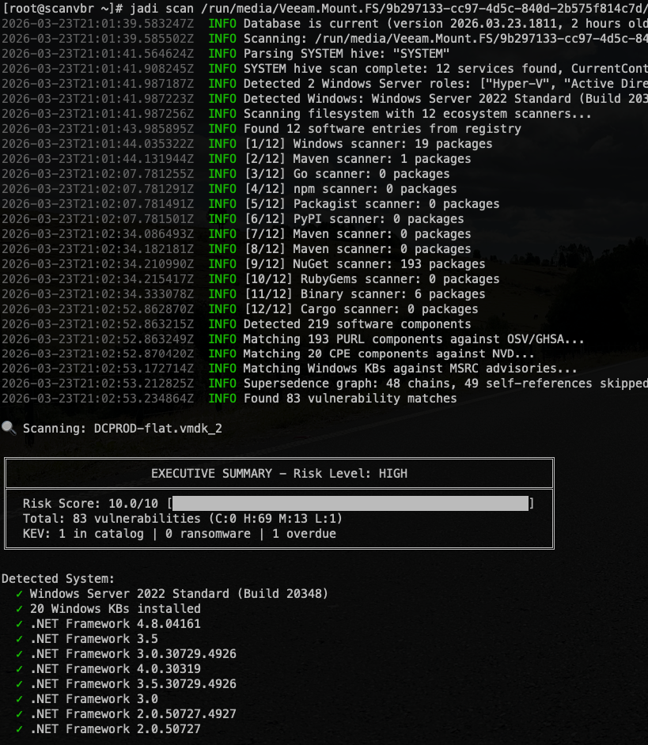
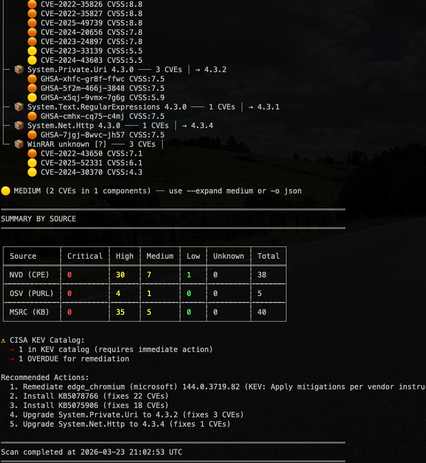

# Jadi Scanner

**Offline vulnerability scanner for mounted backups and live filesystems — with deep Microsoft Windows support**

[](https://github.com/mescobarcl/jadi/releases)
[](LICENSE)
[](https://github.com/mescobarcl/jadi/releases)

Jadi analyzes mounted backup filesystems and live systems to detect installed software, correlate it against multiple vulnerability databases, and generate compliance-ready reports. Built for IT security teams, MSPs, and backup administrators who need to assess the security posture of systems — including Windows servers and workstations — before or after restoration.

## Key Features

- **Windows offline analysis** — Scan Windows backups without booting them: registry hive parsing, KB/patch gap detection, MSRC advisory matching, .NET Framework versioning, supersedence chain resolution, and server role filtering (IIS, DNS, DHCP, Hyper-V, AD)
- **12 ecosystem scanners** — npm, PyPI, Maven, Gradle, Go, NuGet, Composer, RubyGems, Cargo, .NET, JAR, and binary pattern detection
- **5 vulnerability sources** — NVD, OSV, GHSA, MSRC, and CISA KEV (418,000+ vulnerabilities)
- **7 output formats** — Table, JSON, SARIF, CSV, Markdown, SPDX, CycloneDX
- **KEV intelligence** — Known exploited vulnerabilities with ransomware association detection
- **SBOM generation** — SPDX 2.3 and CycloneDX 1.5
- **CI/CD ready** — SARIF output, severity-based exit codes, suppression rules
- **Offline capable** — Scan air-gapped systems with `--offline` flag

## Quick Start

```bash
# Install (Linux x86_64)
curl -LO https://github.com/mescobarcl/jadi/releases/latest/download/jadi-linux-x86_64
curl -LO https://github.com/mescobarcl/jadi/releases/latest/download/jadi-linux-x86_64.sha256
sha256sum -c jadi-linux-x86_64.sha256
chmod +x jadi-linux-x86_64 && sudo mv jadi-linux-x86_64 /usr/local/bin/jadi

# Download vulnerability database
jadi update-db

# Scan a mounted backup
jadi scan /mnt/backup

# Generate JSON report
jadi scan /mnt/backup -o json -f jadi-report.json
```

## Sample Output (Windows Server 2022 — Real Scan)

```
╔════════════════════════════════════════════════════════════════════════════╗
║                    EXECUTIVE SUMMARY - Risk Level: HIGH                    ║
╠════════════════════════════════════════════════════════════════════════════╣
║  Risk Score: 10.0/10 [██████████████████████████████████████████████████]  ║
║  Total: 83 vulnerabilities (C:0 H:69 M:13 L:1)                            ║
║  KEV: 1 in catalog | 0 ransomware | 1 overdue                             ║
╚════════════════════════════════════════════════════════════════════════════╝

Detected System:
  ✓ Windows Server 2022 Standard (Build 20348)
  ✓ 20 Windows KBs installed
  ✓ .NET Framework 4.8, 4.0, 3.5, 3.0, 2.0

Detected 219 software components

VULNERABILITIES BY COMPONENT (83 CVEs in 9 components)

🟠 HIGH (81 CVEs in 8 components)
├─ 📦 edge_chromium (microsoft) 144.0.3719.82 ─── 3 CVEs │ 1 KEV → >=145.0.3800.58
│     🟠 CVE-2023-5217 CVSS:8.8 [KEV]
│     🟠 CVE-2022-38012 CVSS:7.7
├─ 📦 Windows Server 2022 Standard Build 20348 ─── 40 CVEs │ → KB5075906
│     🟠 CVE-2026-25188 CVSS:8.8
│     🟠 CVE-2026-23669 CVSS:8.8
│     ... and 38 more CVEs
├─ 📦 Microsoft SQL Server unknown [?] ─── 21 CVEs │
├─ 📦 Microsoft Visual Studio 14.0 ─── 9 CVEs │
├─ 📦 System.Private.Uri 4.3.0 ─── 3 CVEs │ → 4.3.2
├─ 📦 System.Net.Http 4.3.0 ─── 1 CVEs │ → 4.3.4
└─ 📦 WinRAR unknown [?] ─── 3 CVEs │

SUMMARY BY SOURCE
┌────────────┬──────────┬──────┬────────┬─────┬─────────┬───────┐
│ Source     │ Critical │ High │ Medium │ Low │ Unknown │ Total │
├────────────┼──────────┼──────┼────────┼─────┼─────────┼───────┤
│ NVD (CPE)  │ 0        │ 30   │ 7      │ 1   │ 0       │ 38    │
│ OSV (PURL) │ 0        │ 4    │ 1      │ 0   │ 0       │ 5     │
│ MSRC (KB)  │ 0        │ 35   │ 5      │ 0   │ 0       │ 40    │
└────────────┴──────────┴──────┴────────┴─────┴─────────┴───────┘

⚠ CISA KEV Catalog:
  → 1 in KEV catalog (requires immediate action)
  → 1 OVERDUE for remediation

Recommended Actions:
  1. Remediate edge_chromium (microsoft) 144.0.3719.82 (KEV) [1 KEV]
  2. Install KB5078766 (fixes 22 CVEs)
  3. Install KB5075906 (fixes 18 CVEs)
  4. Upgrade System.Private.Uri to 4.3.2 (fixes 3 CVEs)
  5. Upgrade System.Net.Http to 4.3.4 (fixes 1 CVEs)
```

> Components marked with `[?]` have low detection confidence (version unknown from filesystem detection).

## Windows & Microsoft Analysis

Jadi is designed to scan Windows systems offline — mount a backup image and analyze it from Linux without booting Windows. This is a key differentiator over scanners that require a running OS.

### What Jadi detects on Windows backups

| Capability | Description |
|------------|-------------|
| **Installed software** | Parses `SOFTWARE` and `NTUSER.DAT` registry hives to enumerate all installed applications with versions |
| **Missing KB patches** | Detects which Microsoft KBs are installed vs. missing, cross-referenced against MSRC advisories |
| **Supersedence chains** | Understands that KB5034441 supersedes KB5031356 — avoids false positives from replaced patches |
| **.NET Framework detection** | Detects exact .NET Framework versions (2.0–4.8) from registry, matches against framework-specific MSRC CVEs with KB validation |
| **.NET Core / .NET 5+** | Detects modern .NET applications via `*.deps.json` and `*.csproj` files, matches NuGet packages against OSV/GHSA advisories |
| **Server role filtering** | Identifies IIS, DNS, DHCP, Hyper-V, Active Directory roles — only reports CVEs relevant to installed roles |
| **Windows noise filtering** | `--skip-windows-noise` excludes WinSxS, Installer, Temp, SoftwareDistribution and other high-volume directories |
| **MSRC advisory matching** | 7,600+ Microsoft advisories with product-specific KB mapping |

### Example: Scan a Windows backup

```bash
# Mount a Windows backup image
sudo mount -o ro /dev/sdb1 /mnt/windows-backup

# Scan with Windows noise filtering
jadi scan /mnt/windows-backup --skip-windows-noise

# Only show actively exploited Microsoft vulnerabilities
jadi scan /mnt/windows-backup --kev-only --skip-windows-noise

# Generate compliance report
jadi scan /mnt/windows-backup -o markdown -f windows-audit.md --skip-windows-noise
```

## Installation

```bash
# Download binary and checksum
curl -LO https://github.com/mescobarcl/jadi/releases/latest/download/jadi-linux-x86_64
curl -LO https://github.com/mescobarcl/jadi/releases/latest/download/jadi-linux-x86_64.sha256

# Verify integrity
sha256sum -c jadi-linux-x86_64.sha256

# Install
chmod +x jadi-linux-x86_64
sudo mv jadi-linux-x86_64 /usr/local/bin/jadi

# Verify
jadi --version
```

### Requirements

| Requirement | Details |
|-------------|---------|
| **OS** | Ubuntu 24.04+ / Debian 13+ / any Linux x86_64 with glibc 2.39+
| **Disk** | ~12 MB binary + ~700 MB vulnerability database |
| **Memory** | ~100 MB typical, ~500 MB for large scans |
| **Network** | Required for `update-db`; `--offline` for air-gapped use |

## Commands

### `update-db` — Download vulnerability database

```bash
jadi update-db          # Update if new version available
jadi update-db --force  # Force re-download
```

The database is updated daily and distributed via CDN (~110 MB compressed).

### `db-status` — Check database info

```bash
$ jadi db-status

Vulnerability Database Status
------------------------------
Version:     2026.03.22.2335
Location:    jadi.db
Size:        670.2 MB
Age:         0 hours

Database Contents:
  KEV entries: 1551
  Ransomware-associated: 313
  Total vulnerabilities: 418558
```

### `scan` — Scan for vulnerabilities

```bash
jadi scan /mnt/backup                                    # Basic scan
jadi scan /mnt/backup -o json -f jadi-report.json        # JSON report
jadi scan /mnt/backup --min-severity high                # Filter by severity
jadi scan /mnt/backup --kev-only                         # Only actively exploited (CISA KEV)
jadi scan /mnt/backup --ransomware-only                  # Only ransomware-associated
jadi scan /mnt/backup -o sarif -f results.sarif          # SARIF for GitHub Security
jadi scan /mnt/backup -o spdx -f sbom.spdx.json         # SBOM (SPDX)
jadi scan /mnt/backup -o cyclonedx -f sbom.cdx.json     # SBOM (CycloneDX)
jadi scan /mnt/backup --fail-on-severity high            # CI mode: exit 2 if high+
jadi scan /mnt/backup --expand all                       # Show all vulnerability details
```

### `list-software` — Software inventory

```bash
jadi list-software /mnt/backup
jadi list-software /mnt/backup --show-paths
jadi list-software /mnt/backup -o json
```

## Scan Options

| Option | Description | Default |
|--------|-------------|---------|
| `-o, --output` | Format: table, json, sarif, csv, markdown, spdx, cyclonedx | `table` |
| `-f, --output-file` | Save output to file | stdout |
| `--min-severity` | Minimum: critical, high, medium, low | `low` |
| `--only-ecosystem` | Single ecosystem (npm, maven, etc.) | all |
| `--exclude-path` | Exclude paths (repeatable) | none |
| `--max-depth` | Directory depth (1-100) | `15` |
| `--threads` | Scanning threads (1-128) | auto |
| `--kev-only` | Only CISA KEV vulnerabilities | off |
| `--ransomware-only` | Only ransomware-associated CVEs | off |
| `--skip-windows-noise` | Skip WinSxS, Temp, Installer | off |
| `--offline` | Skip database update check | off |
| `--parallel-match` | Parallel database queries | off |
| `--fail-on-severity` | Exit 2 if findings at/above severity | none |
| `--expand` | Detail level: critical,high,medium,low,all,none | critical,high |

## Output Formats

| Format | Flag | Use Case |
|--------|------|----------|
| Table | `-o table` | Human-readable terminal output |
| JSON | `-o json` | Integration, automation |
| SARIF | `-o sarif` | GitHub/Azure security integration |
| CSV | `-o csv` | Spreadsheet analysis, SIEM import |
| Markdown | `-o markdown` | Documentation, compliance reports |
| SPDX | `-o spdx` | SBOM compliance (ISO/IEC 5962:2021) |
| CycloneDX | `-o cyclonedx` | SBOM security (OWASP standard) |

### JSON Format

The JSON output structure:

```json
{
  "summary": {
    "total_vulnerabilities": 78,
    "by_severity": { "critical": 6, "high": 19, "medium": 20, "low": 3 }
  },
  "Results": [
    {
      "Vulnerabilities": [
        {
          "VulnerabilityID": "GHSA-w24h-v9qh-8gxj",
          "PkgName": "django",
          "InstalledVersion": "3.2.4",
          "Severity": "CRITICAL",
          "Title": "SQL Injection in Django",
          "FixedVersion": "3.2.13",
          "CvssScore": 9.8,
          "References": ["https://nvd.nist.gov/..."]
        }
      ]
    }
  ]
}
```

## Supported Ecosystems

| Ecosystem | Detection Files |
|-----------|-----------------|
| npm | `package-lock.json`, `yarn.lock`, `pnpm-lock.yaml` |
| PyPI | `requirements.txt`, `Pipfile.lock`, `poetry.lock` |
| Maven | `pom.xml` |
| Gradle | `build.gradle`, `build.gradle.kts` |
| Go | `go.mod`, `go.sum` |
| .NET / NuGet | `*.deps.json` (.NET Core/5+), `packages.config` (legacy), `*.csproj` (PackageReference) |
| Composer | `composer.lock` |
| RubyGems | `Gemfile.lock` |
| Cargo | `Cargo.lock` |
| Windows | `SOFTWARE` hive, `NTUSER.DAT` (offline registry parsing, .NET Framework detection) |
| JAR | `META-INF/MANIFEST.MF`, `pom.properties` |
| Binary | Version strings (OpenSSL, Apache, nginx, PHP, MySQL, PostgreSQL, Redis) |

## Vulnerability Sources

| Source | Coverage | Description |
|--------|----------|-------------|
| **NVD** | 130,000+ CVEs | NIST National Vulnerability Database |
| **OSV** | 253,000+ advisories | Open Source Vulnerabilities (Google) |
| **GHSA** | 27,000+ advisories | GitHub Security Advisories |
| **MSRC** | 7,600+ advisories | Microsoft Security Response Center |
| **CISA KEV** | 1,551 CVEs | Known Exploited Vulnerabilities catalog |

**Total: 418,000+ vulnerabilities.** Database updated daily.

## Configuration

Jadi supports TOML configuration. Loads from: `.jadi.toml` (current dir) > `~/.config/jadi/config.toml` > `~/.jadi.toml`

### Vulnerability Suppressions

```toml
[[suppress]]
cve = "CVE-2023-12345"
reason = "False positive — component not reachable"
expires = "2026-12-31"

[[suppress]]
package = "lodash"
reason = "Accepted risk — internal tool only"
expires = "2026-06-30"

[[suppress]]
path = "test/**/*"
reason = "Test fixtures — not deployed"
```

Audit mode (disable all suppressions): `jadi scan /mnt/backup --ignore-suppressions`

## Screenshots

Scanning a Windows Server 2022 backup (mounted VMDK from Veeam):





## Support & Contributing

- **Issues & Bug Reports**: [github.com/mescobarcl/jadi/issues](https://github.com/mescobarcl/jadi/issues)
- **Feature Requests**: Open an issue with the `enhancement` label
- **Questions**: Open an issue with the `question` label

We welcome feedback, bug reports, and feature suggestions from the community.

## License

MIT — see [LICENSE](LICENSE) for details.
